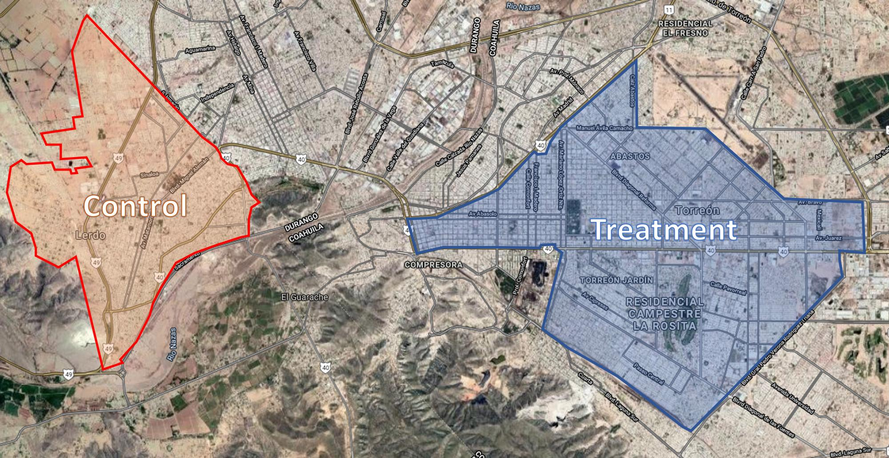

## How does social programs impact health ?

In the latest classification of countries issued by the United Nations, Mexico is categorized as a developing economy. Mexico is at an advanced stage in its demographic transition, the population is expected to stabilize in the upcoming times. In the meantime, governments has to deal with improving quality of life for its population. This is the exact scope of large-scale Mexican program which replaces dirt floors with cements floors, in the city of Torreón. This program, entitled Piso Firme, was first implemented locally in the state of Coahuila. A first study about the impact on health of young children as well as the mental health and happiness of their mothers was established in 2009. Our goal is to extend their work, and further the relationship between housing and children's health. 

The analysis will be restricted to the twin cities of Gómez Palacios and Lerdo (as control) and Torreón (as treatment).

